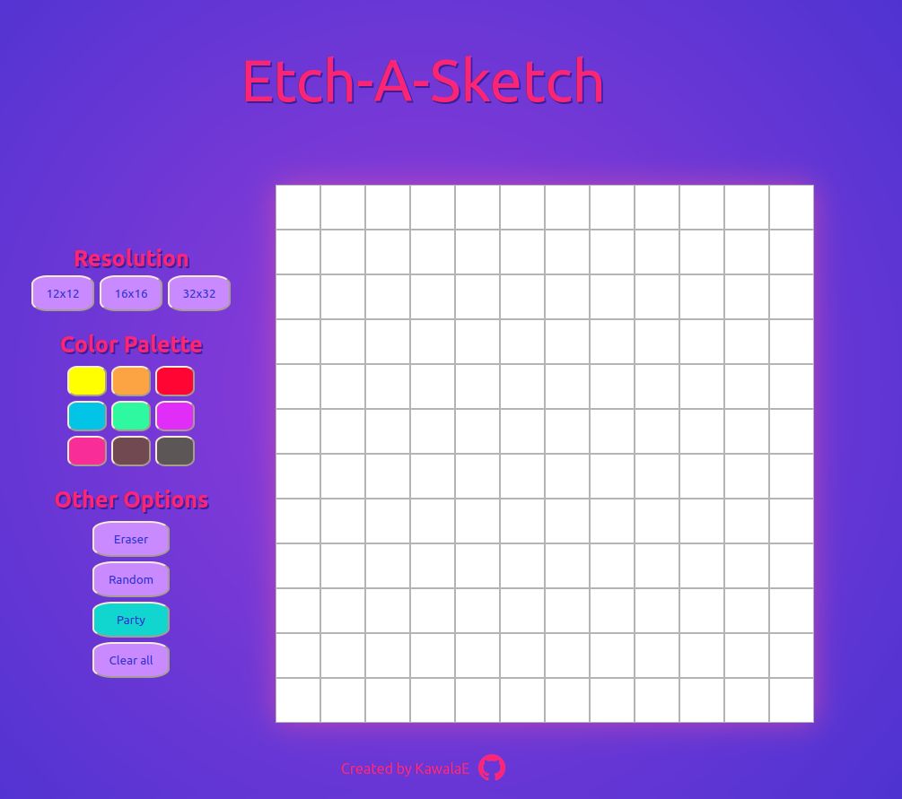

# Etch-a-sketch
Online sketching tool built with Java Script, HTML and CSS.
It is available at the following link: <strong>https://kawalae.github.io/Etch-a-sketch/</strong>

This sketcher allows you to choose between three different grid formats and provides a <strong>color panel</strong> as well as additional options. Those options contain an <strong>Eraser</strong> that allows you to correct the sketch, a <strong>Random</strong> and a <strong>Party</strong> button that allow you to create more abstract pixel art, and
finally, there is a <strong>Clear all</strong> button that clears the canvas so it is ready for the next masterpiece.

  

Acknowledgements:
1. Pen icon: <a href="http://www.freepik.com">Designed by ibrandify / Freepik</a>

